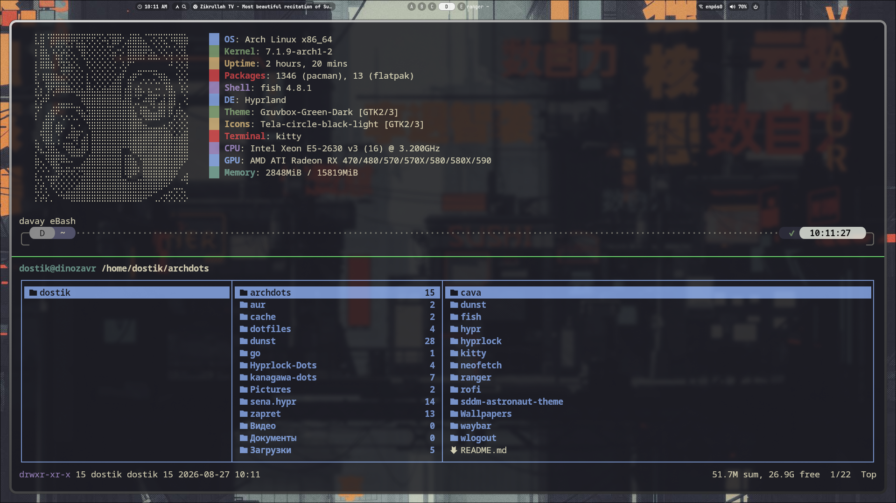
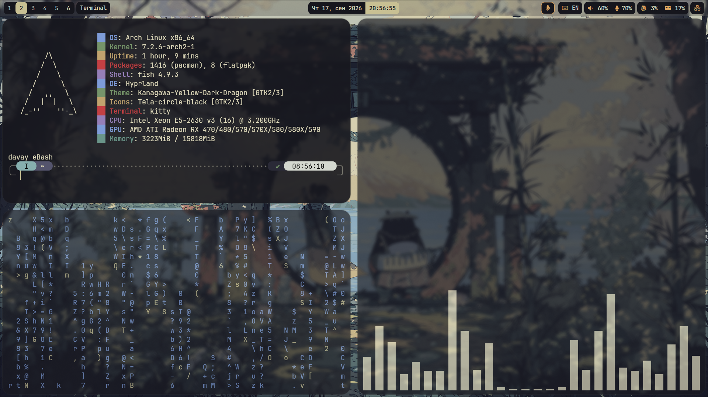

# 🏔️ Hyprland Dotfiles (Lua Config)

Моя персональная конфигурация динамического тайлингового оконного менеджера **Hyprland**, написанная на **Lua** (`hyprland.lua`). Быстрый, кастомный и минималистичный сетап с эстетичным интерфейсом.

## 📸 Скриншоты (Screenshots)

<table width="100%">
  <tr>
    <td width="50%" align="center">
      <b>Рабочее пространство & Терминал</b> 
      
    </td>
    <td width="50%" align="center">
      <b>Экран блокировки (Hyprlock)</b> 
      
    </td>
  </tr>
</table>

## 🛠️ Компоненты системы (Tech Stack)

* **WM:** [Hyprland](https://hyprland.org) — конфигурация на базе Lua файлов (`hyprland.lua`)
* **Панель:** `Waybar` — статус-бар сверху с индикаторами
* **Обои:** `swww` — плавный менеджер бэкграундов
* **Меню приложений:** `Rofi` — лаунчер софта
* **Терминал:** `Kitty` — основной эмулятор терминала
* **Экран блокировки:** `Hyprlock` — кастомный локскрин с аватаром
* **Меню питания:** `wlogout` — графическое меню выхода
* **Уведомления:** `Dunst` — легковесный демон уведомлений
* **Менеджер файлов:** `Ranger` — консольный файловый менеджер в терминале
* **Bluetooth:** `Blueman` — управление беспроводными устройствами

## ⌨️ Горячие клавиши (Keybindings)

* `SUPER + Q` — Закрыть активное окно
* `SUPER + E` — Открыть файловый менеджер (**Ranger** в **Kitty**)
* `SUPER + W` — Переключить плавающий режим окна (Floating)
* `SUPER + F` — Открыть магическое пространство (Magic / Special Workspace)

---
*Настроено с удовольствием. Пользуйтесь на здоровье!*

